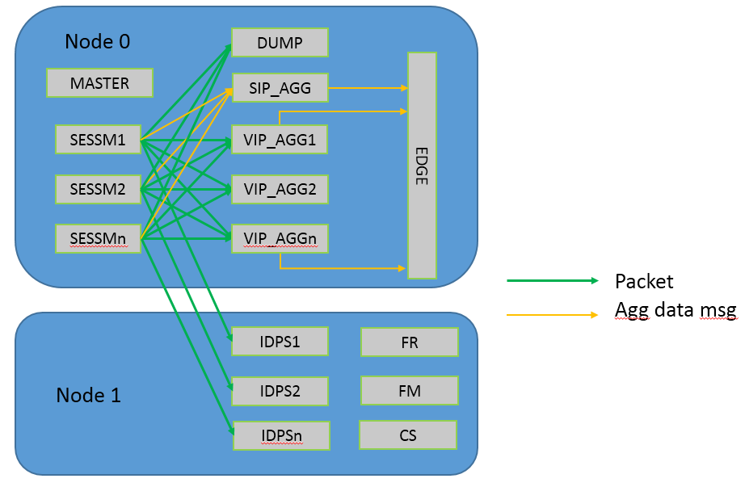

# 配置文件
* qnsm_edge.xml Kafka配置
* qnsm_inspect.cfg DPDK环境配置以及组件部署配置
* qnsm_sessm.xml 采样配置和反射攻击的DFI配置
* qnsm_vip.xml IP网段配置
* suricata.yaml IDPS配置

## qnsm_edge.xml
包含IDC名和所有Kafka配置。

一部分配置用于edge组件输出多维聚合数据，另一部分用于master组件与控制层面的数据分析中心交互。

```xml
<?xml version='1.0' encoding='ASCII'?>
<CONFIG>
    <dc>idc_name</dc>   <!-- IDC名 -->
    <kafka>
    	<name>edge_producer</name>                  <!-- 多维聚合数据kafka, 不要修改name -->
    	<partitions>5</partitions>                  <!-- 默认partition number -->
    	<topics>
    		<qnsm_sip_agg></qnsm_sip_agg>           <!-- 攻击源IP聚合数据以qnsm_sip_agg为前缀 -->
    		<qnsm_vip_agg>                          <!-- VIP聚合数据以以qnsm_vip_agg为前缀 -->
    			<partitions>20</partitions>
    		</qnsm_vip_agg>
    		<qnsm_vip_sport></qnsm_vip_sport>       <!-- VIP的源port聚合数据以以qnsm_vip_sport为前缀 -->
    		<qnsm_vip_dport>                        <!-- VIP的目的port聚合数据以以qnsm_vip_dport为前缀 -->
    			<partitions>20</partitions>
    		</qnsm_vip_dport>
    		<qnsm_sample_flow>                      <!-- 采样flow聚合数据以以qnsm_sample_flow为前缀 -->
    			<partitions>20</partitions>
    		</qnsm_sample_flow>
    	</topics>
    	<brokers>
    		<broker>xxxx:9092</broker>              <!-- broker列表 -->
    		<broker>xxxx:9092</broker>
    		<broker>xxxx:9092</broker>
    		<broker>xxxx:9092</broker>
    		<broker>xxxx:9092</broker>
    	</brokers>
    </kafka>
    <consumer_group>master1</consumer_group>        <!-- 集群部署或者多个QNSM进程，需要指定consumer group-->
    <kafka>
    	<name>cmd_consumer</name>                   <!-- Master消费分析中心事件策略消息的kafka，不要修改name-->
    	<partitions>5</partitions>
    	<topics>
    		<qnsm_command>
    		</qnsm_command>
    	</topics>
    	<brokers>
    		<broker>yyyy:9092</broker>
    		<broker>yyyy:9092</broker>
    		<broker>yyyy:9092</broker>
    		<broker>yyyy:9092</broker>
    		<broker>yyyy:9092</broker>
    	</brokers>
    </kafka>
    <kafka>
    	<name>master_producer</name>                <!-- Master投递策略执行结果，目前投递DDOS攻击应用层类型DFI消息，不要修改name-->
    	<partitions>5</partitions>
    	<topics>
    		<qnsm_command_ack>
    		</qnsm_command_ack>
    	</topics>
    	<brokers>
    		<broker>yyyy:9092</broker>
    		<broker>yyyy:9092</broker>
    		<broker>yyyy:9092</broker>
    		<broker>yyyy:9092</broker>
    		<broker>yyyy:9092</broker>
    	</brokers>
    </kafka>
    <log>											<!-- syslog 配置 -->
        <syslog>
                <facility>local5</facility>
                <log-level>Critical</log-level>				<!-- Emergency/Alert/Critical/Error/Warning/Notice/Info/Debug，级别递增 -->
        </syslog>
    </log>
	<dump-dir>/data/qnsm</dump-dir>					<!-- pcap文件存储目录 -->
</CONFIG>
```

## qnsm_inspect.cfg
DPDK运行环境初始化，比如网卡，内存。

通过该配置文件部署不同组件，可以参考[`link`](http://doc.dpdk.org/guides-16.11/sample_app_ug/ip_pipeline.html)。

QNSM组件包括以下三类：
* 转发面组件：SESSM，VIP_AGG，SIP_AGG，DUMP， EDGE，DETECT
* 控制面组件：MASTER
* IDPS管理服务：FM、FR、CS

CPU开启超线程，两个NUMA node共计48个核心，我们需要给各个组件分配相应CPU资源。
* DDOS检测和IDPS各占用一个NUMA node，每个node 24个逻辑核
* DDOS检测包括SESSM，VIP_AGG，SIP_AGG，DUMP， EDGE，MASTER组件
* IDPS包括DETECT，FM，FR，CS

```bash
$ $RTE_SDK/tools/cpu_layout.py 
============================================================
Core and Socket Information (as reported by '/proc/cpuinfo')
============================================================

cores =  [0, 1, 2, 3, 4, 5, 8, 9, 10, 11, 12, 13]
sockets =  [0, 1]

        Socket 0        Socket 1        
        --------        --------        
Core 0  [0, 24]         [12, 36]        
Core 1  [1, 25]         [13, 37]        
Core 2  [2, 26]         [14, 38]        
Core 3  [3, 27]         [15, 39]        
Core 4  [4, 28]         [16, 40]        
Core 5  [5, 29]         [17, 41]        
Core 8  [6, 30]         [18, 42]        
Core 9  [7, 31]         [19, 43]        
Core 10 [8, 32]         [20, 44]        
Core 11 [9, 33]         [21, 45]        
Core 12 [10, 34]        [22, 46]        
Core 13 [11, 35]        [23, 47]   
```

整体流水线框图如下：



* SIP_AGG，DUMP， EDGE，MASTER，在Node 0各分配一个逻辑核
* SESSM，VIP_AGG各分配Node 0的8个逻辑核
* DETECT在Node 1分配8个或者12个逻辑核（`超过12个的话，DETECT的两个组件在同一个物理core上，性能并不好`），其余的分配给FR，FS，CS。
* 跨Node数据包传输需要复制一份, SESSM和DUMP组件间数据包传输也需要复制一份。

```ini
[EAL]
log_level = 3               ; 日志等级
n = 4                       ; 内存通道数目, 参考https://doc.dpdk.org/guides-16.04/linux_gsg/nic_perf_intel_platform.html#hardware-and-memory-requirements.
socket_mem = 40960,2048     ; numa node0, node1上分配的巨页内存大小，以M为单位
master_lcore = 24           ; DPDK eal初始化逻辑核

[IDPS]
conf_file = suricata.yaml   ; IDPS配置文件名

;mbuf mempool cfg
;add mbuf priavte size para
[MEMPOOL0]                  ; 收包使用mbuf内存池
buffer_size = 2304          ; mbuf大小, 字节为单位
pool_size = 393216          ; DDOS收包内存池大小
cache_size = 256            : mempool per-lcore cache size
cpu = 0	                    ; 表示numa node 0
private_size = 64           ; mbuf私有头大小

[MEMPOOL1]                  ; 数据包dump复制使用的内存池
buffer_size = 2304
pool_size = 131072
cache_size = 256
cpu = 0	                    ; 表示numa node 0
private_size = 64 

[MEMPOOL2]                  ; 跨Numa node数据包传输复制使用的内存池
buffer_size = 2304
pool_size = 262144
cache_size = 256
cpu = 1	                    ；表示numa node 1
private_size = 64 

[LINK0]                     ; 网卡LINK0，支持多个网卡
rss_qs = 0 1 2 3 4 5 6 7    ; 0-7队列开启RSS
rss_proto_ipv4 = TCP UDP    ; Ipv4的RSS方式
rss_proto_ipv6 = TCP TCP_EX UDP UDP_EX ;Ipv6的RSS方式
symmetrical_rss = yes       ; 开启对称hash

[RXQ0.0]                    ; 网卡0的收包队列0
size = 2048                 ; 队列长度
burst = 32                  ; burst收包的大小

[RXQ0.1]
size = 2048 
burst = 32 

[RXQ0.2]
size = 2048 
burst = 32 

[RXQ0.3]
size = 2048 
burst = 32 

[RXQ0.4]
size = 2048 
burst = 32

[RXQ0.5]
size = 2048 
burst = 32

[RXQ0.6]
size = 2048 
burst = 32 
 
[RXQ0.7]
size = 2048 
burst = 32

[SWQ16]                     ; 软件队列16
cpu = 0                     ; Numa node 0
mempool = MEMPOOL1          ; 数据包复制时从MEMPOOL1分配mbuf
dump = yes                  ; dump组件收包使用的队列

[SWQ17]
cpu = 0
mempool = MEMPOOL1
dump = yes

[SWQ18]
cpu = 0
mempool = MEMPOOL1
dump = yes

[SWQ19]
cpu = 0
mempool = MEMPOOL1
dump = yes

[SWQ20]
cpu = 0
mempool = MEMPOOL1
dump = yes

[SWQ21]
cpu = 0
mempool = MEMPOOL1
dump = yes

[SWQ22]
cpu = 0
mempool = MEMPOOL1
dump = yes

[SWQ23]
cpu = 0
mempool = MEMPOOL1
dump = yes

[SWQ24]                     ; 软件队列24
size = 2048                 ; 软件队列长度
cpu = 1                     ; Numa node 1
mempool = MEMPOOL2          ; 数据包复制时从MEMPOOL2分配mbuf
dup = yes                   ; DETECT（IDPS）组件收包使用，跨Node传输，存在一次复制

[SWQ25]
size = 2048
cpu = 1
mempool = MEMPOOL2
dup = yes

[SWQ26]
size = 2048
cpu = 1
mempool = MEMPOOL2
dup = yes

[SWQ27]
size = 2048
cpu = 1
mempool = MEMPOOL2
dup = yes

[SWQ28]
size = 2048
cpu = 1
mempool = MEMPOOL2
dup = yes

[SWQ29]
size = 2048
cpu = 1
mempool = MEMPOOL2
dup = yes

[SWQ30]
size = 2048
cpu = 1
mempool = MEMPOOL2
dup = yes

[SWQ31]
size = 2048
cpu = 1
mempool = MEMPOOL2
dup = yes

;app cfg
[PIPELINE0]                     ; pipeline 组件配置项，编号不要重复即可
type = MASTER                   ; 组件类型，这里是QNSM控制面MASTER组件
core = s0c0h                    ; 部署在node 0 core 0 hyperthread 1

[PIPELINE1]
type = SESSM                    ; SESSM组件，负责IPv4和IPv6数据包解析，采样FLOW数据聚合，TCP连接跟踪，应用层DFI解析。
core = s0c1                     ; 部署在node 0 core 1 hyperthread 0
pktq_in = RXQ0.0                ; 从网卡0的队列0收包
pktq_out = SWQ0 SWQ8 SWQ16 SWQ24 SWQ32 SWQ40 ; 数据包从软件队列发送至DETECT组件（SWQ24），VIP_AGG组件（SWQ0，SWQ8，SWQ32，SWQ40），DUMP组件（SWQ16）
timer_period = 10               ; 定时器调度最小间隔，ms为单位，实时性要求高，可以调小间隔，占用更多CPU资源；反之，调大间隔，释放CPU资源。

[PIPELINE2]
type = SESSM
core = s0c2
pktq_in = RXQ0.1 
pktq_out = SWQ1 SWQ9 SWQ17 SWQ25 SWQ33 SWQ41
timer_period = 10

[PIPELINE3]
type = SESSM
core = s0c3
pktq_in = RXQ0.2 
pktq_out = SWQ2 SWQ10 SWQ18 SWQ26 SWQ34 SWQ42
timer_period = 10

[PIPELINE4]
type = SESSM
core = s0c4
pktq_in = RXQ0.3 
pktq_out = SWQ3 SWQ11 SWQ19 SWQ27 SWQ35 SWQ43
timer_period = 10

[PIPELINE8]
type = SESSM
core = s0c6    
pktq_in = RXQ0.4
pktq_out = SWQ4 SWQ12 SWQ20 SWQ28 SWQ36 SWQ44
timer_period = 10

[PIPELINE9]
type = SESSM
core = s0c9    
pktq_in = RXQ0.5
pktq_out = SWQ5 SWQ13 SWQ21 SWQ29 SWQ37 SWQ45
timer_period = 10

[PIPELINE10]
type = SESSM
core = s0c10    
pktq_in = RXQ0.6
pktq_out = SWQ6 SWQ14 SWQ22 SWQ30 SWQ38 SWQ46
timer_period = 10

[PIPELINE11]
type = SESSM
core = s0c11    
pktq_in = RXQ0.7
pktq_out = SWQ7 SWQ15 SWQ23 SWQ31 SWQ39 SWQ47
timer_period = 10

[PIPELINE12]
type = DUMP                             ; DUMP组件，dump DDOS攻击数据包并保存为pcap文件
core = s0c5                             ; Node 0 core 5 hyperthread 0
pktq_in = SWQ16 SWQ17 SWQ18 SWQ19 SWQ20 SWQ21 SWQ22 SWQ23 ; 收包软件队列
timer_period = 10

[PIPELINE17]
type = SIP_IN_AGG                       ; DDOS攻击源ip数据聚合并输出
core = s0c7h                            ; Node 0 core 7 hyperthread 1

[PIPELINE19]
type = VIP_AGG                          ; IDC公网IP自学习，数据聚合和输出
core = s0c9h
pktq_in = SWQ0 SWQ1 SWQ2 SWQ3 SWQ4 SWQ5 SWQ6 SWQ7
timer_period = 10

[PIPELINE20]
type = VIP_AGG
core = s0c2h
pktq_in = SWQ8 SWQ9 SWQ10 SWQ11 SWQ12 SWQ13 SWQ14 SWQ15
timer_period = 10

[PIPELINE21]
type = VIP_AGG
core = s0c3h
pktq_in = SWQ32 SWQ33 SWQ34 SWQ35 SWQ36 SWQ37 SWQ38 SWQ39
timer_period = 10

[PIPELINE22]
type = VIP_AGG
core = s0c4h
pktq_in = SWQ40 SWQ41 SWQ42 SWQ43 SWQ44 SWQ45 SWQ46 SWQ47
timer_period = 10

[PIPELINE23]
type = EDGE                             ; 数据输出中心，以kafka接口输出
core = s0c7

[PIPELINE24]
type = DETECT                           ; IDPS组件
core = s1c1                             ; 部署在socket 1 core 1 hyperthread 0
pktq_in = SWQ24

[PIPELINE25]
type = DETECT
core = s1c2
pktq_in = SWQ25

[PIPELINE26]
type = DETECT
core = s1c3
pktq_in = SWQ26

[PIPELINE27]
type = DETECT
core = s1c4
pktq_in = SWQ27

[PIPELINE28]
type = DETECT
core = s1c5
pktq_in = SWQ28

[PIPELINE29]
type = DETECT
core = s1c6
pktq_in = SWQ29

[PIPELINE30]
type = DETECT
core = s1c7
pktq_in = SWQ30

[PIPELINE31]
type = DETECT
core = s1c8
pktq_in = SWQ31
```

## qnsm_sessm.xml
SESSM组件相关配置，包括采样配置和反射攻击的DFI配置。

修改采样率配置如下：
```xml
...
	<sample>
		<enable>yes</enable>
		<method>packet</method>
		<rate>4000</rate>
	</sample>
...
```

## qnsm_vip.xml
配置DDOS检测的VIP网段，支持IPv4和IPv6。支持网段组配置。
```xml
<?xml version='1.0' encoding='ASCII'?>
<CONFIG>
	<group>                             
		<name>group1</name>             ; IPv4网段名
        <hosts>
			<ip>x.x.x.x/24</ip>         ; 前缀/掩码长度
			<ip>y.y.y.y/24</ip>
			<ip>z.z.z.z/24</ip>
			<ipv6>xxxx:yyyy:zzzz::/64</ipv6>
		</hosts>
	</group>
	<group>
	    <name>group2</name>
	    <hosts>
			<ip>x.x.x.x/24</ip>         ; 前缀/掩码长度
			<ip>y.y.y.y/24</ip>
			<ip>z.z.z.z/24</ip>
			<ipv6>xxxx:yyyy:zzzz::/64</ipv6>
		</hosts>
	</group>
</CONFIG>
```

## suricata.yaml
IDPS 配置文件。配置文件与suricata的的配置文件基本相同[suricata.yaml](https://raw.githubusercontent.com/OISF/suricata/master/suricata.yaml.in)

需要修改以下几个配置项：
* HOME_NET，需要监控的网段列表
* sensor-name，配置IDPS引擎实例名称
* threading，设置IDPS的管理服务（FR、FS、CS）亲和性绑定cpu set，建议不与`qnsm_inspect.cfg`中的DETECT组件冲突。
* 事件输出kafka配置
* IDPS规则和日志路径配置
* 模式匹配算法配置 


IDPS管理服务亲和性配置。
```yaml
  cpu-affinity:
    - management-cpu-set:
        cpu: [ 23,36,47 ]  # Node 1
```

事件输出kafka配置，在output section添加alert-json-log配置。
```yaml
outputs:
  - alert-json-log:
      enabled: yes
      filetype: kafka
      kafka:
        brokers: > 
         A:9092,
         B:9092,
         C:9092,
         D:9092,
         E:9092
        topic: nsm_event
        partitions: 5
      payload-hex: yes
      http: yes
      http-body-hex: yes
```

规则路径以及规则文件配置。
```yaml
default-rule-path: /usr/local/etc/suricata/rules
rule-files:
 - botcc.rules
 - botcc.portgrouped.rules
 - ciarmy.rules
 - compromised.rules
```

日志路径配置。
```yaml
logging:
  outputs:
  - console:
      enabled: yes
      # type: json
  - file:
      enabled: yes
      level: info
      filename: /usr/local/var/log/suricata/suricata.log
      # type: json
  - syslog:
      enabled: no
      facility: local5
      format: "[%i] <%d> -- "

```

模式匹配算法配置。如果本地安装了hyperscan，多模和单模匹配算法基于hyperscan。

Hyperscan安装参考[using-hyperscan](https://suricata.readthedocs.io/en/latest/performance/hyperscan.html#using-hyperscan)，注意hyperscan依赖于boost库（1.58+）。
```yaml
# The default mpm-algo value of "auto" will use "hs" if Hyperscan is
# available, "ac" otherwise.
mpm-algo: auto

# The default of "auto" will use "hs" if available, otherwise "bm".
spm-algo: auto
```