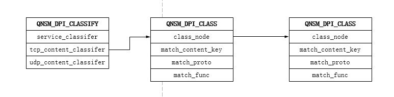
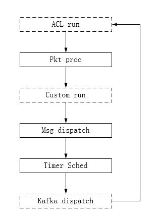

# Architecture
QNSM系统架构如下图：


* 基础模块

    包含PORT，CPU 消息、配置文件、表项管理接口、调度框架等基础功能模块。
* 流水线模块

	SESSM：DDOS检测，负责IPv4和IPv6数据包解析，采样FLOW数据聚合，TCP连接跟踪，应用层DFI解析。
	
	SIP_AGG：DDOS检测攻击源聚合和输出。
	
	VIP_AGG：DDOS检测VIP自学习，数据聚合和输出。
	
	DUMP：DDOS攻击数据包DUMP并保存为pcap文件。
	
	EDGE：类似于broker，输出多维数据至KAFKA。
	
	DETECT：IDPS检测。
* 控制面和工具

	主要包括Master组件以及相关配置文件。
	
	Master负责接收分析中心的攻击事件策略并下发至相应的转发面组件，包含dump数据包，攻击源，攻击源端口，反射攻击proto DFI。
* IDPS管理服务

    FM/FR：IDPS 资源管理和回收
    
    CS：IDPS 统计数据


# 基础库

## 跨CPU无锁消息

主要用于CPU之间的通信，包括两个用途：
* 控制面和转发面间控制消息传输
* DDOS检测多维聚合数据输出

既然需要通信，就不能存在互相影响、相互等待的情况，因为那会影响性能。为此，我们使用了 DPDK 提供的无锁 rte_ring 库，从底层保证通信是无锁的，并且我们在此之上封装一层消息机制来支持一对一，一对多消息。


## PORT

数据平面运行在流水线模式，因此将网卡队列和软件队列抽象为`PORT`。

在配置文件`qnsm_inspect.cfg`中, RXQ和SWQ前缀的配置实际上都是PORT。 

## DPI

QNSM针对DDOS检测提供了简单的DFI/DPI框架，主要用于反射攻击的DFI识别。
```xml
        <protocol>
			<name>ntp</name>
			<enable>yes</enable>
			<parse>no</parse>
		</protocol>
		<protocol>
			<name>ssdp</name>
			<enable>yes</enable>
			<parse>no</parse>
		</protocol>
		<protocol>
			<name>memcache</name>
			<enable>yes</enable>
			<parse>no</parse>
		</protocol>		
```

提供端口和payload两种方式的DFI识别，应用层协议组织成链的形式。



注册接口如下：
* qnsm_dpi_service_classify_reg
* qnsm_dpi_content_classify_reg

## 调度
QNSM提供统一的调度框架，包括收发包，消息分发，定时器等。

* qnsm_service_run



如果统一调度框架不能满足需求，组件可以自定义调度：

* qnsm_service_run_reg

# 组件

QNSM分解不同的功能为独立的组件。不同组件可以部署在不同的CPU上，一个组件可以部署多个实例，不允许在同一个CPU上部署多个组件。

## 添加自己的组件
### 添加组件宏
在`app.h`文件的APP_MAP 列表新增组件宏。

以DUMMY组件为例，第二列组件名需要与qnsm_inspect.cfg中pipeline type一致。
```c
#define APP_MAP(XX)                         \
  XX(EN_QNSM_SESSM,     "SESSM")            \
  XX(EN_QNSM_SIP_AGG,   "SIP_IN_AGG")       \
  XX(EN_QNSM_VIP_AGG,   "VIP_AGG")          \
  XX(EN_QNSM_EDGE,      "EDGE")             \
  XX(EN_QNSM_MASTER,    "MASTER")           \
  XX(EN_QNSM_DETECT,    "DETECT")           \
  XX(EN_QNSM_DUMP,      "DUMP")             \
  XX(EN_QNSM_TEST,      "TEST")             \
  XX(EN_QNSM_DUMMY,     "DUMMY")           
```

组件宏定义在qnsm_service_ex.h头文件。
```c
typedef enum
{
    EN_QNSM_SESSM = 0,
    EN_QNSM_SIP_AGG,
    EN_QNSM_VIP_AGG,
    EN_QNSM_EDGE,
    EN_QNSM_MASTER,
    EN_QNSM_DETECT,
    EN_QNSM_DUMP,
    EN_QNSM_TEST,
    EN_QNSM_DUMMY,
    EN_QNSM_APP_MAX
}EN_QNSM_APP;
```

### 修改配置文件qnsm_inspect.cfg 
确定dummy组件在流水线中的位置，dummy组件从网卡收包，对包进行计数。
```ini
[EAL]
log_level = 3
n = 4
socket_mem = 2048
file_prefix = qnsm
master_lcore = 24

;mbuf mempool cfg
;add mbuf priavte size para
[MEMPOOL0]
buffer_size = 2304
pool_size = 65536
cache_size = 256
cpu = 0	;socket_id
private_size = 64 ;sizeof(QNSM_PACKET_INFO)

;link cfg
[LINK0]
rss_qs = 0 1 2 3 4 5 6 7
rss_proto_ipv4 = TCP UDP
rss_proto_ipv6 = TCP TCP_EX UDP UDP_EX
symmetrical_rss = yes

[RXQ0.0]
size = 2048 
burst = 32 

;app cfg
[PIPELINE0]
type = MASTER
core = s0c0h ;lcore24

[PIPELINE1]
type = DUMMY
core = s0c1 
pktq_in = RXQ0.0 
timer_period = 10
```

### 注册组件初始化回调函数
首先，定义新组件的数据区和数据结构。

其次, 添加组件初始化回调.

在组件初始化函数中，主要做以下几件事
* 申请组件数据区
* 注册组件包处理，包动作，自定义的调度函数
* 消息订阅和发包
* 注册消息收发回调
* 注册DFI/DPI回调函数
* 初始化Kafka生产者和消费者

DUMMY组件数据结构：
```c
/*
* dummy data, just pkt stats
*/
typedef struct
{
    uint64_t total_pkts;
    uint64_t total_bytes;
    uint32_t run_time;
}DUMMY_DATA;

```
app_lcore_main_loop中添加组件初始化回调：
```c
    static QNSM_APP_INIT init_fun[EN_QNSM_APP_MAX] = {
        qnsm_sess_service_init,
        qnsm_service_cus_ip_agg_init,
        qnsm_service_svr_host_init,
        qnsm_edge_service_init,
        qnsm_master_init,
#ifdef QNSM_LIBQNSM_IDPS
        qnsm_detect_service_init,
#else
        NULL,
#endif
        qnsm_service_dump_init,
        NULL,
        qnsm_dummy_init,
    };
```

DUMMY组件初始化函数，qnsm_app_inst_init分配了组件数据区，并注册了包处理函数qnsm_dummy_pkt_proc。
```c
int32_t qnsm_dummy_init(void)
{
    DUMMY_DATA *data = NULL;
    
    data = qnsm_app_inst_init(sizeof(DUMMY_DATA),
                        qnsm_dummy_pkt_proc,
                        NULL,
                        NULL);
    if (NULL == data)
    {
        QNSM_ASSERT(0);
    }

    return 0;
}
```

# API接口
## PORT
```c
/**
 * tx pkt load balance
 *
 * @param pos
 *   hash seed
 * @param mbuf
 *   pkt mbuf
 * @return
 *   0 success, other failed
 */
int32_t qnsm_port_tx_lb(uint32_t pos, struct rte_mbuf *mbuf);

/**
 * tx pkt to kernel net-stack
 *
 * @param pos
 *   hash seed
 * @param mbuf
 *   pkt mbuf
 * @return
 *   0 success, other failed
 */
int32_t qnsm_port_tap_tx_lb(uint32_t pos, struct rte_mbuf *mbuf);

/**
 * send pkt load balance to duplicate ports
 *
 * @param pos
 *   hash seed
 * @param mbuf
 *   pkt mbuf
 * @return
 *   0 success, other failed
 */
int32_t qnsm_port_dup_tx_lb(uint32_t pos, struct rte_mbuf *mbuf);

/**
 * send pkt load balance to dump ports
 *
 * @param mbuf
 *   pkt mbuf
 * @return
 *   0 success, other failed
 */
int32_t qnsm_port_dump_tx(struct rte_mbuf *mbuf);
```
## MSG
```c
 /**
 * app publish msg service
 *
 * @return
 *   0 success, other failed
 */
int32_t qnsm_msg_publish(void);

/**
 * msg subscribe
 *
 * @param target_lcore_id
 *   subscribe app deployed on target_lcore_id
 * @return
 *   0 success, other failed
 */
int32_t qnsm_msg_subscribe(uint32_t target_lcore_id);

/**
 * regesiter msg rcv or send encap cbk
 *
 * @param msg_id
 *   msg id used
 * @param msg_proc
 *   rcv cbk
 * @param msg_encap
 *   encap cbk when send msg
 * @return
 *   0 success, -1 failed
 */
int32_t qnsm_msg_reg(EN_QNSM_MSG_ID msg_id, QNSM_MSG_PROC msg_proc, QNSM_MSG_ENCAP msg_encap);

/**
 * send msg to all app instances
 *
 * @param app_type
 *   send msg to app
 * @param msg_id
 *   msg id used
 * @param data
 *   msg data ptr
 * @param sync
 *   whether send sync
 * @return
 *   0 success, -1 failed
 */
int32_t qnsm_msg_send_multi(EN_QNSM_APP app_type, EN_QNSM_MSG_ID msg_id, void *data, uint16_t sync);
int32_t qnsm_msg_send_lb(EN_QNSM_APP app_type, EN_QNSM_MSG_ID msg_id, void *data, uint32_t seed, uint16_t sync);
int32_t qnsm_msg_send_all(EN_QNSM_MSG_ID msg_id, void *data);
```

## DFI/DPI
```c
/**
* classify cbk fun prototype
*/
typedef void (*QNSM_DPI_CLASS_MATCH_FUN)(QNSM_PACKET_INFO *pkt_info, void *sess, void **arg);

/**
 * reg payload content classify cbk
 *
 * @param dpi_classfy_proto
 *   EN_DPI_PROT_TCP/UDP
 * @param str
 *   payload content head
 * @param len
 *   payload content len
 * @param match_proto
 *   app proto
 * @param func
 *   classify cbk fun
 * @return
 *   0 success, other failed
 */
int32_t qnsm_dpi_content_classify_reg(EN_QNSM_DPI_L4_PROT dpi_classfy_proto, const char *str, const uint8_t len, EN_QNSM_DPI_PROTO match_proto, QNSM_DPI_CLASS_MATCH_FUN func);

/**
 * reg dport classify cbk
 *
 * @param dpi_classfy_proto
 *   EN_DPI_PROT_TCP/UDP
 * @param dport
 * @param match_proto
 *   app proto
 * @param func
 *   classify cbk fun
 * @return
 *   0 success, other failed
 */
int32_t qnsm_dpi_service_classify_reg(EN_QNSM_DPI_L4_PROT dpi_classfy_proto, uint16_t dport, EN_QNSM_DPI_PROTO match_proto, QNSM_DPI_CLASS_MATCH_FUN func);
```

## KAFKA
```c
/**
 * init kafka producer
 *
 * @param cfg ptr
 *   kafka conf parsed from qnsm_edge.xml
 * @return
 *   0 success, other failed
 */
int32_t qnsm_kafka_app_init_producer(void *cfg);

/**
 * init kafka consumer
 * 
 * @param dc_name
 *   idc name, as part of kafka consumer group name
 * @param cfg ptr
 *   kafka conf parsed from qnsm_edge.xml
 * @return
 *   0 success, other failed
 */
int32_t qnsm_kafka_app_init_consumer(const char *dc_name, void *cfg);

/**
 * register topic's consumer cbk
 * 
 * @param topic
 *   topic id
 * @param cons_fun
 *   consume topic cbk fun
 */
void qnsm_kafka_msg_reg(EN_QNSM_KAFKA_TOPIC topic, QNSM_KAFKA_MSG_CONSUMER cons_fun);

/**
 * send kafka msg 
 *
 * @param topic
 *   topic id
 * @param type
 *   just set 0
 * @param obj
 *   cJSON obj
 * @param partition
 *   set partition id
 */
void qnsm_kafka_send_msg(EN_QNSM_KAFKA_TOPIC topic, QNSM_KAFKA_METRIC_TYPE type, void *obj, uint16_t partition);

/**
 * dispatch kafka msg
 */
void qnsm_kafka_msg_dispatch(void);
```
## COMPONENT
```c
/**
 * launch app
 *
 * @param para
 *   app para
 * @param init_fun
 *   app init cbk fun
 * @return
 *   0 success, other failed
 */
int32_t qnsm_servcie_app_launch(void *para,
                                            QNSM_APP_INIT init_fun);

/**
 * register app own service run
 *
 * @param run
 *   app own run function
 * @return
 *   0 success, other failed
 */
int32_t qnsm_service_run_reg(QNSM_APP_RUN run);

/**
 * get app data
 *
 * @param type
 *   component/app type
 * @return
 *   app data ptr
 */
inline void* qnsm_app_data(EN_QNSM_APP type);

/**
* init app inst
* @param size
*   app data structure size
* @param pkt_proc
*   pkt proc fun, may be null
* @param action
*   after pkt proc, execute pkt action, tx or drop pkt
* @param run
*   app custom run fun, normally null
*/
inline void* qnsm_app_inst_init(uint32_t size,
                                            QNSM_APP_PKT_PROC pkt_proc,
                                            QNSM_APP_ACTION action,
                                            QNSM_APP_RUN run);
```