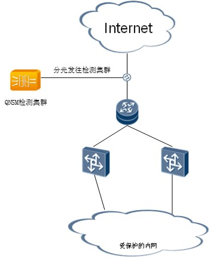
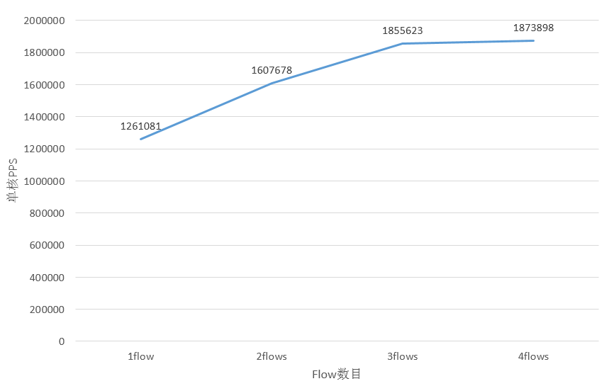
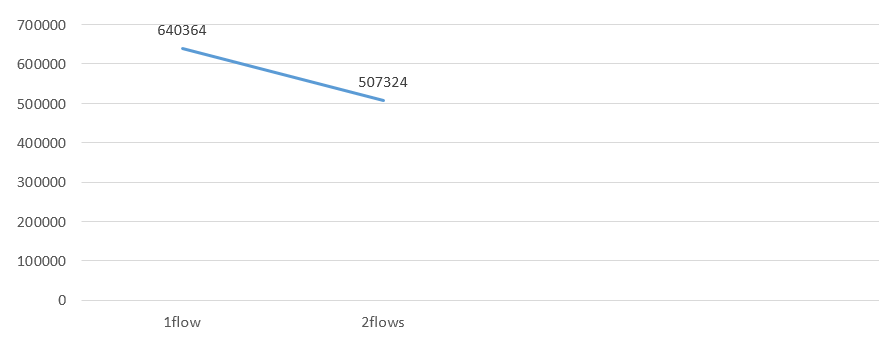
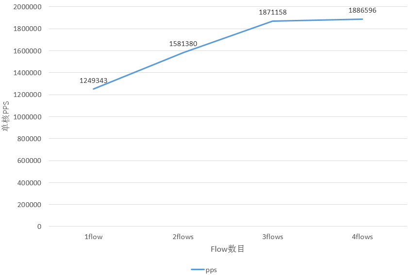
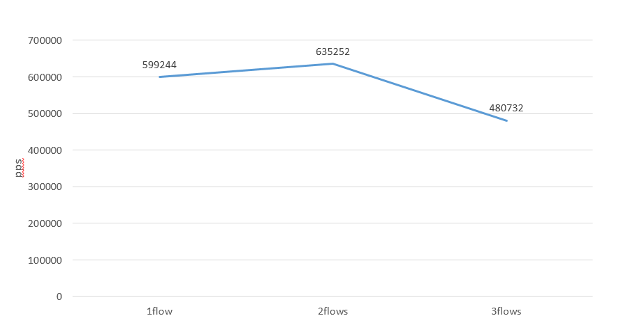

# 网络拓扑


# 测试环境
- Linux Distribution: CentOS Linux release 7.2.1511
- Kernel: 3.10.0-327.el7.x86_64
- CPU: Intel(R) Xeon(R) CPU E5-2650 v4 @ 2.20GHz - 24 cores total, HT enabled and used for 48 hardware threads.
- NIC: Intel Corporation Ethernet 10G 2P X520 Adapter (rev 01)
- Memory: 100G+ with two NUMA node.
- GCC: gcc version 4.8.5 20150623 (Red Hat 4.8.5-4)
- IDPS 基于Suricata 4.1.0

QNSM支持DDOS检测，IDPS独立部署以及混合部署。因此分别测试三种部署方式的性能。

混合部署的时候，DDOS检测与IDPS跨NUMA节点存在报文复制。

由于QNSM架构决定了性能随着核心数线性增长，因此这里测试了QNSM单核性能，以pps作为衡量标准。

# 打开调试模式
修改config文件， 设置`CONFIG_DEBUG_QNSM=y`, 重新编译QNSM生成debug版本。

我们通过调试命令查看SESSM组件的pps（Packet Per-Second ）。

# 测试方法
使用hping工具，小包64字节，逐步增加flow数目，x.x.x.x为测试IP，控制流量至单个逻辑核心上。如果pps数据没有增长，则认为达到性能瓶颈。

```bash
$ hping3 -q -n --keep -S -s 20000 -p 80 --flood x.x.x.x
$ hping3 -q -n --keep -S -s 20007 -p 80 --flood x.x.x.x
$ hping3 -q -n --keep -S -s 200014 -p 80 --flood x.x.x.x
$ hping3 -q -n --keep -S -s 200021 -p 80 --flood x.x.x.x
```

# 背景流量

* 1Mpps左右
* 丰富的流量类型，包括http，dns，smtp，tls，ssh，smb
* 平均包大小：458字节

# 仅部署DDOS检测

工作负载：
* SESSM 8个逻辑核
* VIP_AGG 4个逻辑核
* SIP_IN_AGG，DUMP，EDGE 分别占用一个逻辑核



DDOS检测单核性能为`1.8mpps`。

# 仅部署IDPS检测

IDPS性能跟跟很多因素有关，包括包大小，连接数，流量类型（http，dns，smtp，tls等等），规则数量，使用的CPU逻辑核数目，具体可以参考[SEPTun](https://github.com/pevma/SEPTun)。

工作负载：
* 加载2800+规则
* IDPS检测占用逻辑核数目：10，管理占用逻辑核数目：3



IDPS检测单核性能为`640Kpps`。

# DDOS检测模块和IDPS模块混合部署

DDOS工作负载：
* SESSM 8个逻辑核
* VIP_AGG 4个逻辑核
* SIP_IN_AGG，DUMP，EDGE 分别占用一个逻辑核

IDPS工作负载：
* 加载2800+规则
* IDPS检测占用逻辑核数目：10，管理占用逻辑核数目：3

## DDOS检测性能



DDOS检测单核性能为`1.8mpps`。

## IDPS性能



单核处理能力为`635Kpps`。因此，相比于IDPS独立部署，性能没有损失。

# 调试命令
## 查看网口统计数据
```bash
QNSM>> show_flow port
```

## 查看SESSM组件信息
包括采样的五元组数目，逻辑核pps。
```bash
QNSM>> show_sess type 
lcore 2 tcp_sess(v4) 1323 udp_sess 83
lcore 2 tcp_sess(v6) 11udp_sess 0
lcore 2 inner pkts 0 outer pkts 1714704 filter pkts 0bits 0 pps 190924 bps 0
lcore 4 tcp_sess(v4) 1336 udp_sess 85
lcore 4 tcp_sess(v6) 14udp_sess 0
lcore 4 inner pkts 0 outer pkts 1694081 filter pkts 0bits 0 pps 197222 bps 0
lcore 6 tcp_sess(v4) 1311 udp_sess 85
lcore 6 tcp_sess(v6) 7udp_sess 0
lcore 6 inner pkts 0 outer pkts 1662528 filter pkts 0bits 0 pps 187828 bps 0
lcore 8 tcp_sess(v4) 1332 udp_sess 105
lcore 8 tcp_sess(v6) 8udp_sess 0
lcore 8 inner pkts 0 outer pkts 1729377 filter pkts 0bits 0 pps 196113 bps 0
lcore 16 tcp_sess(v4) 1415 udp_sess 97
lcore 16 tcp_sess(v6) 9udp_sess 0
lcore 16 inner pkts 0 outer pkts 1815722 filter pkts 0bits 0 pps 210717 bps 0
lcore 18 tcp_sess(v4) 1444 udp_sess 83
lcore 18 tcp_sess(v6) 25udp_sess 0
lcore 18 inner pkts 0 outer pkts 1843706 filter pkts 0bits 0 pps 222687 bps 0
lcore 20 tcp_sess(v4) 1451 udp_sess 72
lcore 20 tcp_sess(v6) 15udp_sess 0
lcore 20 inner pkts 0 outer pkts 1807607 filter pkts 0bits 0 pps 215499 bps 0
lcore 22 tcp_sess(v4) 1428 udp_sess 65
lcore 22 tcp_sess(v6) 10udp_sess 0
lcore 22 inner pkts 0 outer pkts 1767293 filter pkts 0bits 0 pps 205317 bps 0
total sess num 11814
```

## 查看vip信息
```bash
QNSM>> show_flow vip 
=====lcore 10  vip4 statis=====

VIP xxx.xxx.xxx.xxx  mask 32 local_vip 1
>>>>>> cur pkt num 440989275 pps 55343 bps 57511353 frag_pkt_pps 0
<<<<<< cur pkt num 305717129 pps 38450 bps 48964173 frag_pkt_pps 0
...
```

## 查看数据集统计数据
```bash
QNSM>> show_kafka 
 [UINT32]: show_kafka [topic]
QNSM>> show_kafka 3
================
topic qnsm_vip_agg
partition 0 tx_statis 3210 tx_drop_statis 0 rx_statis 0
partition 1 tx_statis 3266 tx_drop_statis 0 rx_statis 0
partition 2 tx_statis 3099 tx_drop_statis 0 rx_statis 0
partition 3 tx_statis 2957 tx_drop_statis 0 rx_statis 0
partition 4 tx_statis 3461 tx_drop_statis 0 rx_statis 0
partition 5 tx_statis 2989 tx_drop_statis 0 rx_statis 0
partition 6 tx_statis 3038 tx_drop_statis 0 rx_statis 0
partition 7 tx_statis 3133 tx_drop_statis 0 rx_statis 0
partition 8 tx_statis 3069 tx_drop_statis 0 rx_statis 0
partition 9 tx_statis 3491 tx_drop_statis 0 rx_statis 0
```
